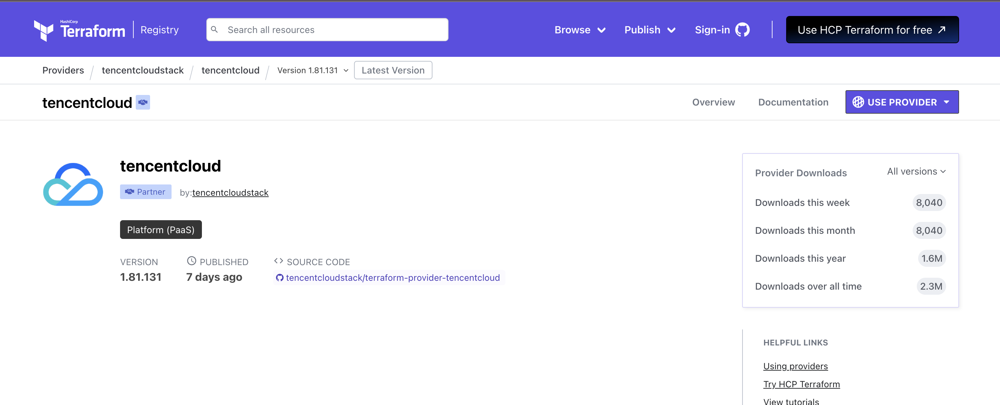
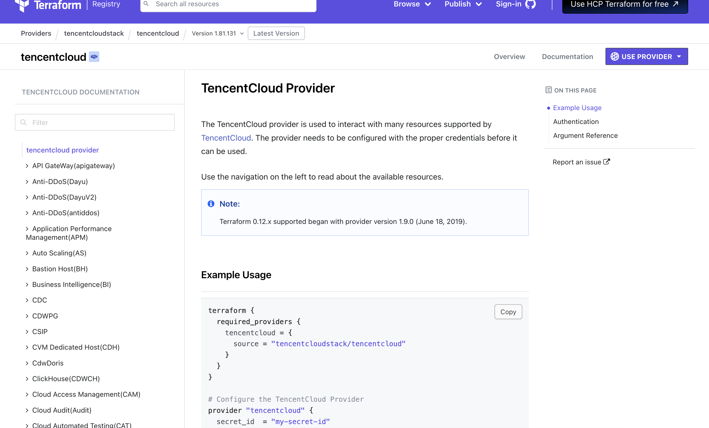
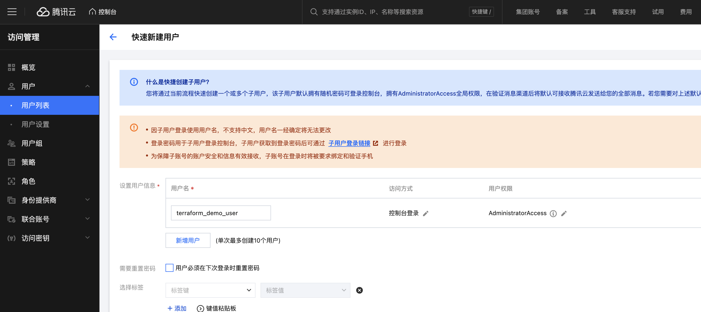
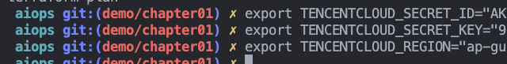

# Lab 01 - Terraform basics

## Provision a CVM from tencent cloud, and inside that CVM, install docker

### Step 1: go to [terraform registry](https://registry.terraform.io/) and search for "tencentcloud"



### Step 2: in the documentation section, check the example usage



### Step 3: go to your tencent cloud account, create a new user for this demo



### Step 4: create a new API key for this user and store that API key and secrets


### Step 5: Terraform init, terraform plan, terraform apply -auto-approve

Next run these commands:

```hcl
terraform init
terraform plan
terraform apply -auto-approve
```
