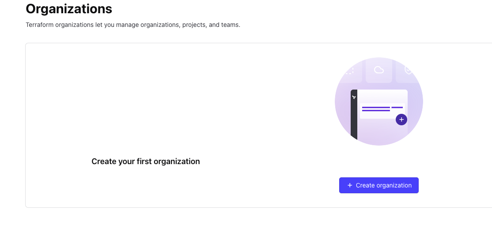
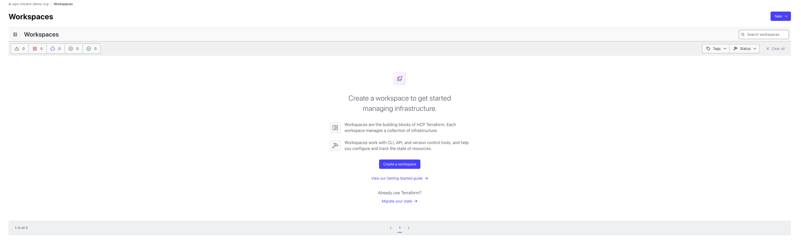
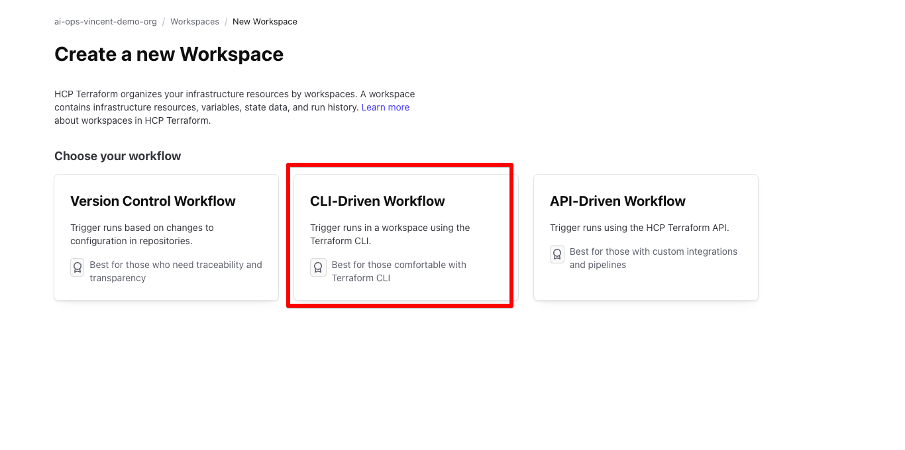
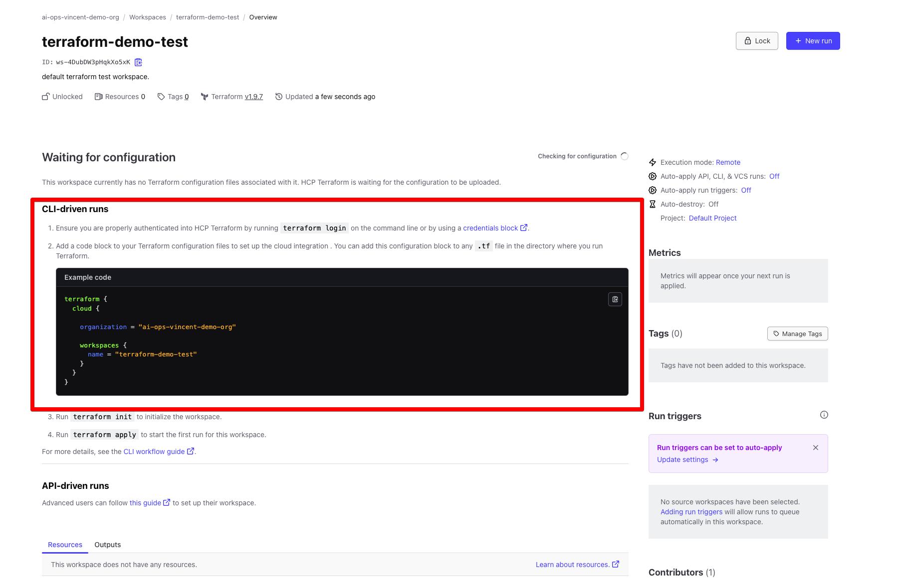
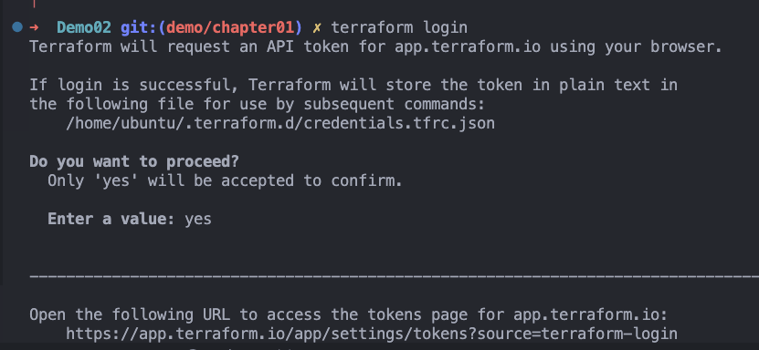
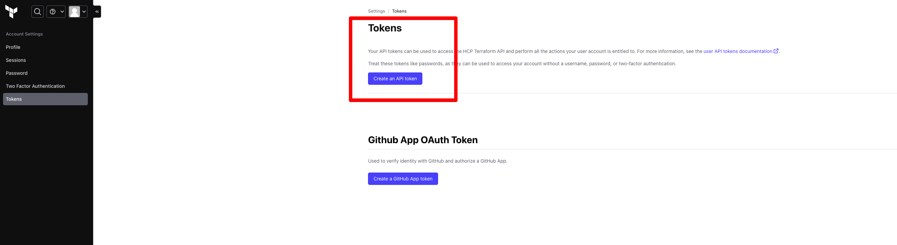
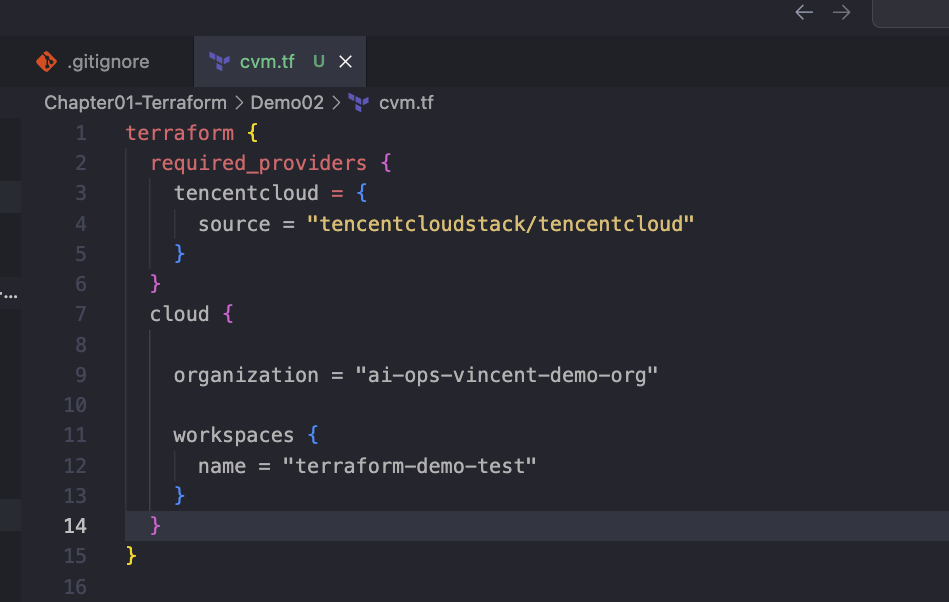
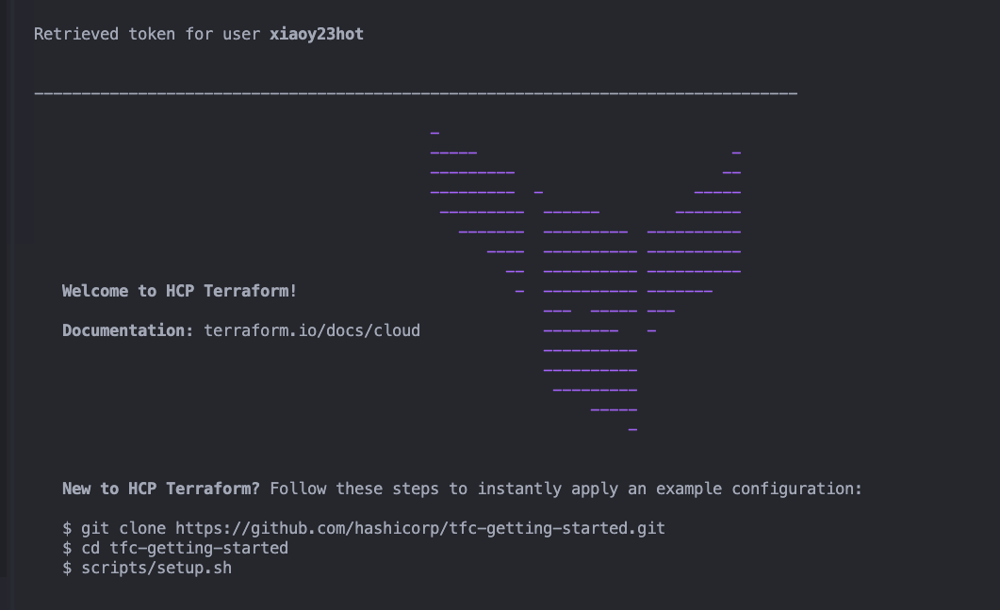
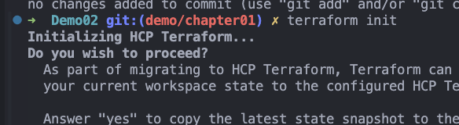
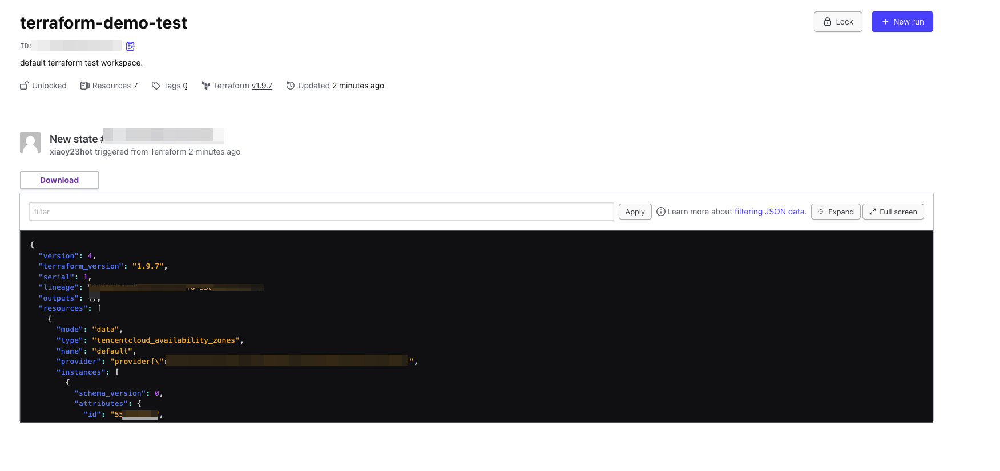

# Lab Guide: Create a Terraform Organization and Version State Files Using Terraform Cloud

---

### Step 1: Create Your First Organization

- Log in to your Terraform Cloud account.
- Go to the "Organizations" tab.
- Click the "**+ Create organization**" button.
  


- Fill in the required information for the organization (e.g., name, email).
  
---

### Step 2: Create a Workspace

- After creating the organization, go to the "**Workspaces**" tab.
- Click on "**Create a workspace**".
  


---

### Step 3: Select the CLI-Driven Workflow

- You will be presented with different options for the workflow.
- Choose "**CLI-Driven Workflow**" since we will run the Terraform code locally.



---

### Step 4: Get the Terraform Cloud Configuration Block

- Terraform Cloud will show you a configuration block that needs to be added to your Terraform configuration files. This block allows Terraform to push the state file to the Terraform Cloud workspace.

```hcl
terraform {
  cloud {
    organization = "your-org-name"

    workspaces {
      name = "your-workspace-name"
    }
  }
}
```



---

### Step 5: Authenticate Terraform with Terraform Cloud

- Run the following command in your terminal to log in to Terraform Cloud from your local environment:
  
```bash
terraform login
```

- This command will ask for your confirmation to proceed. Type `yes` to continue.



- You will be redirected to the Terraform Cloud website to generate your API token.

---

### Step 6: Create an API Token in Terraform Cloud

- Navigate to "**Account Settings**" in Terraform Cloud.
- Go to the "**Tokens**" section and click "**Create an API Token**".



- Once the token is generated, use it to authenticate your Terraform CLI locally.

---

### Step 7: Add the Configuration Block to Your Terraform Files

- Add the `terraform` block that you copied earlier into your Terraform project’s `.tf` file, typically in a file like `main.tf`.

```hcl
terraform {
  required_providers {
    tencentcloud = {
      source = "tencentcloudstack/tencentcloud"
    }
  }

  cloud {
    organization = "your-org-name"

    workspaces {
      name = "your-workspace-name"
    }
  }
}
```



---

### Step 8: Initialize Terraform and Run the First Plan

- Now that everything is set up, you can initialize your Terraform project by running:

```bash
terraform init
```



- Terraform will ask if you wish to proceed with using Terraform Cloud as the backend for state files. Type `yes` to continue.

---

### Step 9: View the State File in Terraform Cloud

- After running the init and applying your configuration, you can check the Terraform Cloud UI to verify that the state file is now stored in the cloud.
  

  


---

### Conclusion

You have successfully created a Terraform Cloud organization and workspace, linked your local environment with Terraform Cloud, and verified that the state file is stored remotely in Terraform Cloud. This setup helps in managing your infrastructure securely and ensures collaboration among team members.
