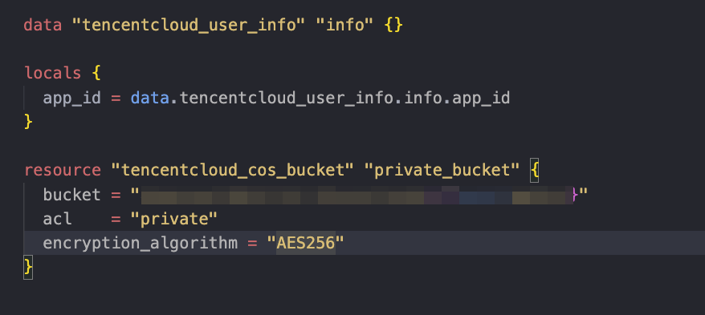
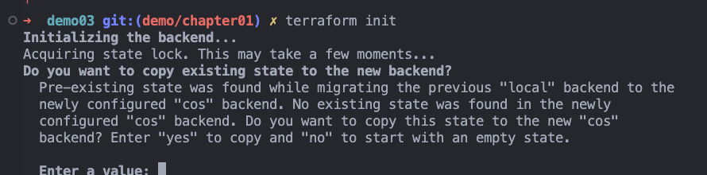
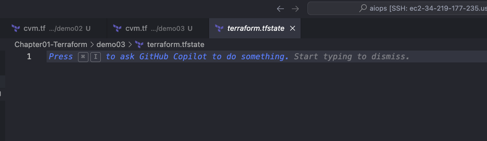

# Lab Guide: Store Terraform State Files in Tencent Cloud COS Bucket

---

## Introduction

This guide walks you through the process of configuring your Terraform project to store state files in a Tencent Cloud COS (Cloud Object Storage) bucket. Storing your state files in a remote backend ensures that your state is safely stored and accessible for collaboration.

---

## Step 1: Configure Tencent Cloud User Info

- First, we will use the `tencentcloud_user_info` data source to get the necessary information about our Tencent Cloud account.

```hcl
data "tencentcloud_user_info" "info" {}

locals {
  app_id = data.tencentcloud_user_info.info.app_id
}
```



---

## Step 2: Create a COS Bucket with Encryption

- Create a COS bucket resource in Tencent Cloud using Terraform, specifying the encryption algorithm as `AES256` for added security.

```hcl
resource "tencentcloud_cos_bucket" "private_bucket" {
  bucket = "your-bucket-name"
  acl    = "private"
  encryption_algorithm = "AES256"
}
```

---

## Step 3: Update Backend Configuration to Use COS

- Update your Terraform backend configuration to store the state file in the COS bucket you created. Add this to your Terraform code:

```hcl
terraform {
  backend "cos" {
    region  = "ap-guangzhou"
    bucket  = "aiops-your-bucket-name"
    prefix  = "terraform-state"
    encrypt = true
  }
}
```
---

## Step 4: Run `terraform init` to Migrate the State File

- Once the backend configuration has been updated, initialize Terraform by running `terraform init`. This will prompt you to copy your existing state to the new COS backend.

```bash
terraform init
```

- When prompted, enter `yes` to copy the existing state to the new backend.



---

## Step 5: Verify the State File Migration

- After initialization, verify that the state file is now stored in your Tencent Cloud COS bucket. You should be able to see the `.tfstate` file in the bucket.



## Step 6: Destory the resource

- After creation, if you want to destory the who infra, you need to first manually delete the contents in the cos bucket, before you can run "terraform destory"
---

## Conclusion

By following these steps, you’ve successfully configured your Terraform project to store its state file in Tencent Cloud COS, ensuring better collaboration and secure state management.
